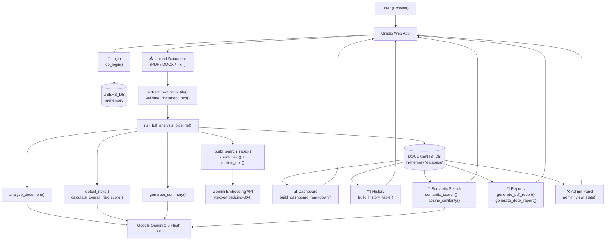

# ⚖️ AI-Powered Contract & Legal Document Risk Analyzer
**Teyzix Core Internship — Task AI-3**

An AI tool that reads a contract (PDF/DOCX/TXT), pulls out the important
clauses, flags risky or missing terms, summarizes it in plain English, and
lets you ask it questions — all powered by Google Gemini and served through
a Gradio web app.

---

## 🏗️ Architecture Diagram

**Flow in words:** the user logs in → uploads a document → the text is
extracted and validated → one pipeline function fans out to four AI tasks
(structured analysis, risk detection, summary, and building a searchable
embedding index) → results are stored in an in-memory "database" → every
other tab (Dashboard, History, Search, Reports, Admin) simply reads from
that same store.

---

## 🧰 Tech Stack
| Layer | Tool |
|---|---|
| Language | Python (Google Colab) |
| LLM | Google Gemini 2.5 Flash (`gemini-2.5-flash`) |
| Embeddings | Gemini `text-embedding-004` |
| UI | Gradio |
| PDF reading | `pypdf` |
| DOCX read/write | `python-docx` |
| PDF report generation | `reportlab` |
| Math (similarity search) | `numpy` |

---

## ▶️ How to Run (Google Colab)
1. Open a new Google Colab notebook.
2. Copy each `# %% [CELL n]` block from `contract_risk_analyzer.py` into its
   own Colab cell, keeping the same order.
3. In **Cell 2**, paste your free Gemini API key into `GEMINI_API_KEY`
   (get one at https://aistudio.google.com/app/apikey).
4. Run all cells top to bottom.
5. The last cell prints a public Gradio link — open it.
6. Log in with a demo account:
   - `admin / admin123` → full access, including the Admin Panel
   - `user / user123` → normal user access
7. Go to **Analyze Document**, upload a contract, and click **Analyze with AI**.

---

## 📖 Function Reference

Every function in `contract_risk_analyzer.py`, what it does, and how to use it.

### 1. Document Upload & Reading

**`extract_text_from_file(file_path)`**
- **What it does:** Reads a PDF, DOCX, or TXT file and returns its plain text.
- **Parameters:** `file_path` (str) — path to the uploaded file.
- **Returns:** `str` — the extracted text.
- **Example:** `text = extract_text_from_file("contract.pdf")`

**`validate_document_text(text)`**
- **What it does:** Basic sanity check — rejects empty or too-short documents
  before wasting an AI call on them.
- **Parameters:** `text` (str).
- **Returns:** `True` if valid; raises `ValueError` if not.
- **Example:** `validate_document_text(text)`

---

### 2. Talking to Gemini (helper wrappers)

**`ask_gemini_for_json(prompt)`**
- **What it does:** Sends a prompt to Gemini and safely parses the reply as
  JSON (strips markdown code fences, catches parse errors).
- **Parameters:** `prompt` (str).
- **Returns:** `dict` or `list` (parsed JSON), or `{"error": ...}` on failure.
- **Example:** `data = ask_gemini_for_json('Return {"hello": "world"} as JSON')`

**`ask_gemini_for_text(prompt)`**
- **What it does:** Same idea, but for when you just want a plain text answer
  (used by semantic search).
- **Parameters:** `prompt` (str).
- **Returns:** `str`.
- **Example:** `answer = ask_gemini_for_text("Explain this clause simply: ...")`

---

### 3. AI Document Analysis

**`analyze_document(document_text)`**
- **What it does:** Extracts contract type, parties, dates, payment terms,
  renewal/confidentiality/termination clauses, and responsibilities.
- **Parameters:** `document_text` (str) — full contract text.
- **Returns:** `dict` matching the schema in the code (see comments).
- **Example:** `analysis = analyze_document(text)`

---

### 4. Risk Detection

**`detect_risks(document_text)`**
- **What it does:** Finds missing clauses, high-risk conditions, ambiguous
  wording, unusual payment terms, and legal red flags. Each risk includes a
  `severity` and a `confidence_score` (0–100).
- **Parameters:** `document_text` (str).
- **Returns:** `list[dict]` — one dict per detected risk.
- **Example:** `risks = detect_risks(text)`

**`calculate_overall_risk_score(risks)`**
- **What it does:** Combines all individual risks into one overall score
  (0–100), weighting higher-severity risks more heavily.
- **Parameters:** `risks` (list[dict]) — output of `detect_risks()`.
- **Returns:** `float`.
- **Example:** `score = calculate_overall_risk_score(risks)`

---

### 5. AI Summary

**`generate_summary(document_text)`**
- **What it does:** Produces an executive summary, key obligations, important
  dates, important clauses, and recommended next actions.
- **Parameters:** `document_text` (str).
- **Returns:** `dict`.
- **Example:** `summary = generate_summary(text)`

---

### 6. Semantic Search / Mini-RAG Pipeline

**`chunk_text(text, chunk_size=800, overlap=100)`**
- **What it does:** Splits a long document into smaller overlapping pieces
  so embeddings stay accurate and no clause gets cut off at a boundary.
- **Parameters:** `text` (str), `chunk_size` (int), `overlap` (int).
- **Returns:** `list[str]`.
- **Example:** `chunks = chunk_text(text)`

**`embed_text(text)`**
- **What it does:** Converts a piece of text into a numeric embedding vector
  using Gemini's embedding model.
- **Parameters:** `text` (str).
- **Returns:** `numpy.ndarray`.
- **Example:** `vector = embed_text("payment must be made within 30 days")`

**`cosine_similarity(vec_a, vec_b)`**
- **What it does:** Measures how similar two embedding vectors are
  (1 = same meaning, 0 = unrelated).
- **Parameters:** two `numpy.ndarray` vectors.
- **Returns:** `float`.
- **Example:** `score = cosine_similarity(vec1, vec2)`

**`build_search_index(document_text)`**
- **What it does:** Chunks a document and embeds every chunk, ready for
  semantic search later.
- **Parameters:** `document_text` (str).
- **Returns:** `(chunks, embeddings)` tuple.
- **Example:** `chunks, embeddings = build_search_index(text)`

**`semantic_search(query, chunks, embeddings, top_k=3)`**
- **What it does:** Finds the most relevant chunks for a natural-language
  question, then asks Gemini to answer using only those chunks (RAG).
- **Parameters:** `query` (str), `chunks` (list[str]), `embeddings` (list of
  vectors), `top_k` (int, how many chunks to use).
- **Returns:** `str` — the AI's answer.
- **Example:** `answer = semantic_search("What are the payment terms?", chunks, embeddings)`

---

### 7. Report Generation

**`generate_pdf_report(doc_record, output_path)`**
- **What it does:** Builds a formatted PDF report (summary, contract details,
  risk table, recommendations) for one analyzed document.
- **Parameters:** `doc_record` (dict, one entry from `DOCUMENTS_DB`),
  `output_path` (str, where to save the PDF).
- **Returns:** `output_path` (str).
- **Example:** `generate_pdf_report(doc_record, "report.pdf")`

**`generate_docx_report(doc_record, output_path)`**
- **What it does:** Same report, saved as a Word document instead.
- **Parameters/Returns:** same shape as above.
- **Example:** `generate_docx_report(doc_record, "report.docx")`

---

### 8. Main Pipeline

**`run_full_analysis_pipeline(file_path, filename, uploaded_by)`**
- **What it does:** Runs the whole process end-to-end for one uploaded file:
  extract → validate → analyze → detect risks → summarize → build search
  index → save into `DOCUMENTS_DB`.
- **Parameters:** `file_path` (str), `filename` (str), `uploaded_by` (str,
  the logged-in username).
- **Returns:** `dict` — the complete document record.
- **Example:** `doc = run_full_analysis_pipeline("contract.pdf", "contract.pdf", "user")`

---

### 9. Display / Formatting Helpers
*(Turn raw data into readable Markdown for the Gradio UI — no AI calls here.)*

| Function | What it formats |
|---|---|
| `format_analysis_markdown(analysis)` | Contract details table |
| `format_risks_markdown(risks, risk_score)` | Risk list with emojis by severity |
| `format_summary_markdown(summary)` | Executive summary + obligations + actions |
| `build_dashboard_markdown()` | Dashboard stats across all documents |
| `build_history_table()` | Table of every document ever analyzed |

---

### 10. Gradio UI Handlers
*(Each of these is wired directly to a button/dropdown in the interface.)*

| Function | Triggered by |
|---|---|
| `do_login(username, password)` | "Login" button |
| `do_analyze(file_obj, username)` | "Analyze with AI" button |
| `get_doc_choices()` / `find_doc_by_choice(choice)` | Populating/reading dropdowns |
| `do_semantic_search(doc_choice, query)` | "Search" button |
| `do_generate_report(doc_choice, report_format)` | "Generate Report" button |
| `refresh_dashboard()` | "Refresh Dashboard" button |
| `refresh_history()` | "Refresh History" button |
| `refresh_dropdowns()` | Auto-runs after a new document is analyzed |
| `admin_view_stats(role)` | "View System Stats" button (admin only) |

---

## ⚠️ Scope Notes
The original task spec asks for full production user authentication, a
persistent database (PostgreSQL/SQLite), and a multi-user admin backend.
Since this runs as a single Google Colab + Gradio session (no persistent
server), those are **simulated** with simple in-memory Python structures
(`USERS_DB`, `DOCUMENTS_DB`) — documented clearly in the code. Every **AI
feature** (analysis, risk detection, summarization, semantic search/RAG,
reports, dashboard) is fully implemented and functional.

## 💡 Possible Bonus Additions
- OCR for scanned PDF contracts (`pytesseract`)
- Email report delivery
- AI Compliance Score
- Multi-language document support
